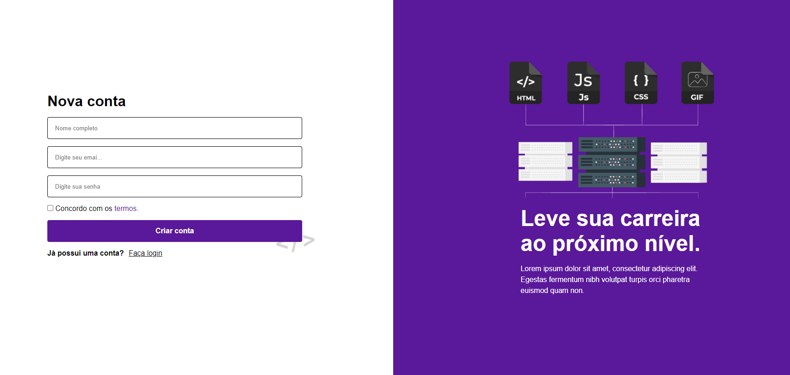

# Login page

Este é um projeto de página de login e cadastro, criado para fins de estudo, com o objetivo de praticar responsividade e design.

## Demonstração



## Sobre o Projeto

Este projeto consiste em uma página de login e cadastro, utilizando apenas HTML e CSS. O foco está no design responsivo e na estrutura semântica do código. Não há funcionalidades em JavaScript, apenas uma estrutura estática

## Tecnologias Utilizadas

- **HTML5**: para a marcação da estrutura da página.
- **CSS3**: para a estilização e design responsivo.

## Funcionalidades

- Layout responsivo adaptado para diferentes tamanhos de tela (desktop, tablet e mobile).
- Estilo visual moderno e agradavel.
- Estrutura semântica de HTML para facilitar a acessibilidade.

## Como Executar

1. Clone o repositório:
   ```bash
   git clone https://github.com/henriquedevop/login-page-form.git

2. Navegue até a pasta do projeto::
   ```bash
   cd src

3. Abra o arquivo index.html no seu navegador.